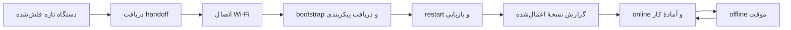

وضعیت دستگاه یک مقدار واحد نیست. یک دستگاه ممکن است از نظر provisioning آماده
باشد، از نظر حضور offline باشد و هم‌زمان یک نسخهٔ پیکربندی pending داشته باشد.
جدا نگه‌داشتن این وضعیت‌ها باعث می‌شود مشکل را درست پیدا کنید.

| بخش وضعیت | پرسش | نمونه |
| --- | --- | --- |
| provisioning | هویت Flova نصب شده است؟ | awaiting، provisioned |
| presence | دستگاه اخیراً متصل بوده است؟ | online، offline |
| configuration | نسخهٔ مطلوب اعمال شده است؟ | pending، applied، verifying |
| administrative | اجازهٔ استفاده دارد؟ | active، disabled، archived |

## مسیر عادی

offline بودن الزاماً به معنی خراب‌شدن provisioning نیست. پس از قطع شبکه،
firmware باید طبق policy محلی خودش کار کند و با برگشت اتصال، وضعیت و دادهٔ
لازم را همگام کند. اگر نسخهٔ پیکربندی گزارش نشود، Engine اجازه نمی‌دهد فقط با
دیدن heartbeat، دستگاه را کاملاً آماده فرض کنیم.

## همین مرزها در SDK

در firmware سفارشی، برای نمایش وضعیت محلی از APIهای SDK استفاده کنید؛ این
مقادیر جایگزین presence سمت Engine نیستند:

| مفهوم | API یا فیلد SDK |
| --- | --- |
| provisioning و مرحلهٔ داخلی | `provisioning()` و `lifecycle()` |
| شبکهٔ محلی | `networkConnected` |
| کانال Flova Link | `linkConnected` یا `connected()` |
| آماده‌بودن runtime | `runtimeReady` |
| آماده‌بودن کامل datastream | `ready` |
| نسل configuration فعال | `configurationGeneration` |

`setStatusListener()` تغییر این مرزها را به‌صورت event گزارش می‌کند. برای
وضعیت فعلی از `status()` استفاده کنید. `networkConnected` به‌تنهایی به معنی
online بودن دستگاه در Console نیست و `ready` نیز جایگزین مشاهدهٔ advancing
presence در Engine نمی‌شود.

## هنگام عیب‌یابی

اول بپرسید مشکل در کدام مرز است: QR و handoff، Wi-Fi، اتصال Link، دریافت
configuration، restart، یا اجرای سخت‌افزار. صفحهٔ جزئیات دستگاه در Console
باید آخرین وضعیت و زمان مشاهده را نشان دهد. برای معنی دقیق پیام‌های عملیاتی،
[عیب‌یابی](/docs/support/troubleshooting) را ببینید.
